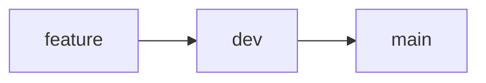

# RaknaDocs: Basics

[](https://starlight.astro.build)

```
pnpm create astro@latest -- --template starlight
```

## 🚀 Project Structure

Inside of your Astro + Starlight project, you'll see the following folders and files:

```
.
├── public/
├── src/
│   ├── assets/
│   ├── content/
│   │   └── docs/
│   └── content.config.ts
├── astro.config.mjs
├── package.json
└── tsconfig.json
```

Starlight looks for `.md` or `.mdx` files in the `src/content/docs/` directory. Each file is exposed as a route based on its file name.

Images can be added to `src/assets/` and embedded in Markdown with a relative link.

Static assets, like favicons, can be placed in the `public/` directory.

## Tooling

- Astro
- Tailwind
- Vite+
- oxc and Prettier
- pnpm

## 🧞 Commands

All commands are run from the root of the project, from a terminal:

| Command                | Action                                           |
| :--------------------- | :----------------------------------------------- |
| `pnpm install`         | Installs dependencies                            |
| `pnpm dev`             | Starts local dev server at `localhost:4321`      |
| `pnpm build`           | Build your production site to `./dist/`          |
| `pnpm preview`         | Preview your build locally, before deploying     |
| `pnpm astro ...`       | Run CLI commands like `astro add`, `astro check` |
| `pnpm astro -- --help` | Get help using the Astro CLI                     |
| `pnpm format`          | For consistent formatting of all files           |
| `pnpm check`           | Astro and vp check, format + lint + type-check   |

## 👀 Want to learn more?

Check out [Starlight’s docs](https://starlight.astro.build/), read [the Astro documentation](https://docs.astro.build).

## Vite+

Use Vite+ in my project. Vite+ is the unified toolchain for the web behind the `vp` CLI — one tool combining Vite, Rolldown, Vitest, tsdown, Oxlint, Oxfmt, and Vite Task, plus runtime and package-manager management.

Read https://viteplus.dev/llms-full.txt to learn Vite+'s commands and configuration.

Install the `vp` CLI:

- macOS / Linux: curl -fsSL https://vite.plus | bash
- Windows (PowerShell): irm https://vite.plus/ps1 | iex

Then open a new terminal and run `vp help`. To scaffold a new project run `vp create`; to move an existing Vite project onto Vite+ run `vp migrate`.

Day-to-day commands: `vp install` (dependencies), `vp check` (format + lint + type-check), `vp test` (tests).

## Setup steps

```bash
pnpm create astro@latest raknaDocs -- --template starlight/tailwind
cd raknaDocs
git init
vp migrate
pn add -D prettier prettier-plugin-astro prettier-plugin-tailwindcss
pn add -D typescript@6
pn astro check -y
pn dev
```

## git workflow



```bash

# Develop new feature/branch
git switch -c feature
git commit -m "feat: feature"

# Merge new branch to dev first
git switch dev
git merge --no-ff feature -m "merge: feature branch"
git push -u origin dev

# Merge dev to main or do a pull request
git switch main
git merge dev
git push origin main

# Optionally delete the feature branch
# git branch -d feature
```

## TODO

[] Copy by clicking for inline code
[] Copy one line of text from code blocks
[] pg_basebackup/WAL archiving for backups of @postgres subvolume
[] Coolify
[]
