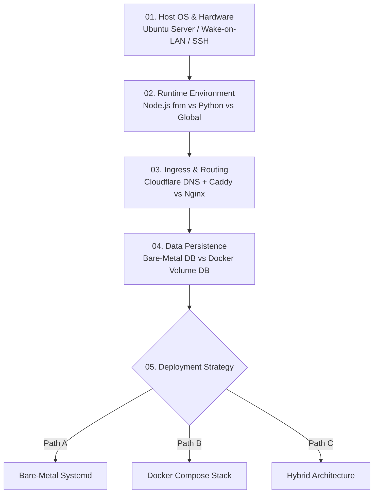

import { Card, CardGrid, LinkCard, Steps } from "@astrojs/starlight/components";

Welcome to the **Home Server Setup & Deployment Runbook**. This documentation is structured as a **Choose Your Own Adventure (CYOA)** decision tree, allowing you to select your preferred operating system, runtime, ingress layer, data persistence model, and deployment strategy.

## 🧭 Architecture Decision Flowchart

Follow the modular layers in sequence. Each layer is decoupled so you can swap out technologies at any step without breaking the rest of your infrastructure.

---

## 📦 Modular Infrastructure Layers

<CardGrid>
  <Card title="01. Host Platform & Remote Access" icon="laptop">
    Hardware setup, Ubuntu Server configuration, SSH key-based authentication, and Wake-on-LAN (WoL)
    setup. [Explore Host Setup →](/home-server/01-host-and-access)
  </Card>
  <Card title="02. Runtime & Process Management" icon="setting">
    Configure execution environments: Fast Node Manager (`fnm`), Python virtual environments, and
    system environment variables. [Explore Runtimes →](/home-server/02-runtimes)
  </Card>
  <Card title="03. Ingress & Domain Routing" icon="globe">
    Domain DNS management via Cloudflare API and automatic HTTPS reverse proxying with Caddy or
    Nginx. [Explore Ingress →](/home-server/03-ingress-and-routing)
  </Card>
  <Card title="04. Data Layer & Persistence" icon="external">
    Compare bare-metal database installations (PostgreSQL / MySQL) against containerized database
    volumes and backup policies. [Explore Data Layer →](/home-server/04-database-and-storage)
  </Card>
  <Card title="05. Deployment Strategies" icon="rocket">
    Choose your deployment model: Bare-metal Systemd services, fully containerized Docker Compose
    stacks, or hybrid setups. [Explore Deployments →](/home-server/05-deployment-strategies)
  </Card>
</CardGrid>

---

## 🚀 Quick Start Checklist

<Steps>

1. **Provision Host OS:** Setup legacy/dedicated hardware with Ubuntu Server and configure SSH key access.
2. **Setup Runtimes:** Install `fnm` for Node.js or `uv`/`venv` for Python depending on your app needs.
3. **Configure Ingress:** Point Cloudflare DNS to your IP and let Caddy automate SSL certificates.
4. **Deploy Services:** Spin up your application via Docker Compose or native Systemd user services.

</Steps>
